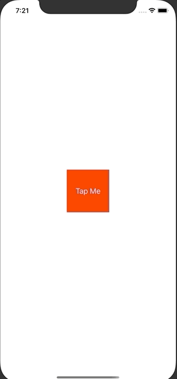

+++
title =  "SwiftでPDFを作成する"
url = "2020-04-03"
date = "2020-04-03"
description = "SwiftでPDFを作成する"
tags = [
    "Swift"
]
categories = [
    "Swift"
]
archives = "2020/04"
aliases = ["migrate-from-jekyl"]
+++

 

Swift で PDF を作成する方法です。
PDFKit で簡単に PDF を作ることができました、素敵ですね。

<!-- Google Ads -->


<!-- Amazon Ads -->


参考: [Creating a PDF in Swift with PDFKit](https://www.raywenderlich.com/4023941-creating-a-pdf-in-swift-with-pdfkit)


