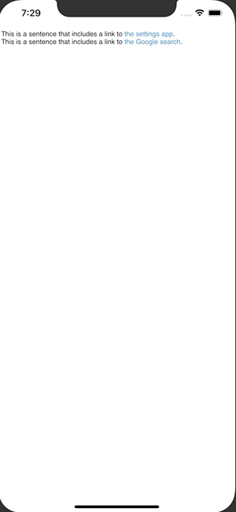

+++
title =  "SwiftUI で文字列中にタップ可能なリンクを追加する"
url = "2020-05-03"
date = "2020-05-03"
description = "SwiftUI で文字列中にタップ可能なリンクを追加する"
tags = [
    "Swift",
    "SwiftUI"
]
categories = [
    "Swift",
    "SwiftUI"
]
archives = "2020/05"
aliases = ["migrate-from-jekyl"]
+++

 

SwiftUI で文字列中にタップ可能なリンクを追加するを作成する方法です。
`UIViewRepresentable` と `UITextView` を使って実現しました。

Reference: [UITextViewにタップ可能なリンクを挿入する](https://qiita.com/shtnkgm/items/3c8b6b794219fbf087ba)

<!-- Google Ads -->


<!-- Amazon Ads -->



