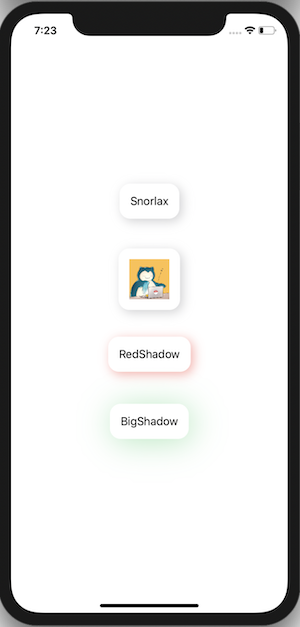

+++
title =  "FunctionBuilderを使ってViewに影をつける"
url = "2020-05-07"
date = "2020-05-07"
description = "FunctionBuilderを使ってViewに影をつける"
tags = [
    "Swift",
    "SwiftUI"
]
categories = [
    "Swift",
    "SwiftUI"
]
archives = "2020/05"
aliases = ["migrate-from-jekyl"]
+++

 

FunctionBuilderを使ってViewに影をつける方法です。
FunctionBuilderとViewModifier、どっちを使うか迷う時が良くあります。
関連してこちらもどうぞ。

[ViewModifierを使ってViewに影をつける](/2020-05-06/)

<!-- Google Ads -->


<!-- Amazon Ads -->



