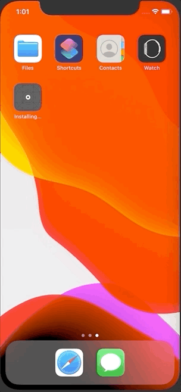

+++
title =  "SwiftUIでアプリ起動時に画面を遷移させる"
url = "2020-05-12"
date = "2020-05-12"
description = "SwiftUIでアプリ起動時に画面を遷移させる"
tags = [
    "Swift",
    "SwiftUI"
]
categories = [
    "Swift",
    "SwiftUI"
]
archives = "2020/05"
aliases = ["migrate-from-jekyl"]
+++

 

SwiftUIでアプリ起動時に画面を遷移させる方法です。
登録の導線で途中離脱したらその途中から再開させるようなUXを実現させようとしました。
NavigationLink の isActive を使って遷移していますが、遅延時間を設定しないとアプリの挙動がおかしくなってしまうので気をつけてください。

<!-- Google Ads -->


<!-- Amazon Ads -->



