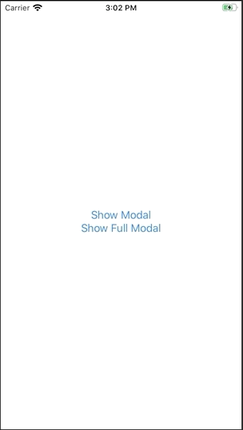

+++
title =  "SwiftUIでモーダルからフルモーダルを表示する"
url = "2020-05-13"
date = "2020-05-13"
description = "SwiftUIでモーダルからフルモーダルを表示する"
tags = [
    "Swift",
    "SwiftUI"
]
categories = [
    "Swift",
    "SwiftUI"
]
archives = "2020/05"
aliases = ["migrate-from-jekyl"]
+++

 

SwiftUIでモーダルからフルモーダルを表示する方法です。
以下の記事の改良版？です。

[SwiftUIでフルスクリーンモーダルを表示する](/2020-05-05/)

<!-- Google Ads -->


<!-- Amazon Ads -->



