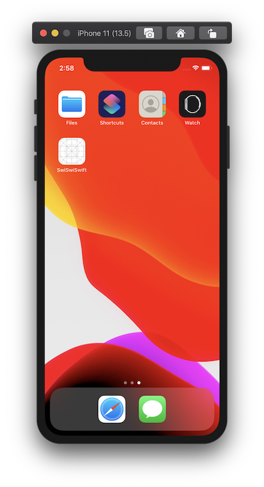
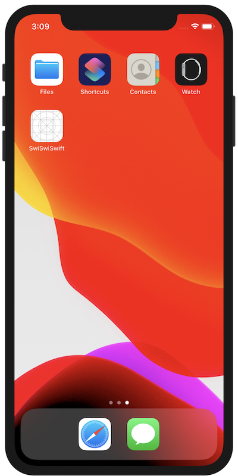

+++
title =  "シミュレーターのスクリーンショットを影無しで撮影する（ツールバー無しで撮影する）"
url = "2020-05-14"
date = "2020-05-14"
description = "SwiftUIでアプリ起動時に画面を遷移させる"
tags = [
    "Swift",
    "SwiftUI"
]
categories = [
    "Swift",
    "SwiftUI"
]
archives = "2020/05"
aliases = ["migrate-from-jekyl"]
+++

 

シミュレーターのスクリーンショットを影無しで撮影する（ツールバー無しで撮影する）方法です。
command + shift + 4 でスクリーンショットの撮影モードにしたあとに、スペースで撮影対象となる画面を選択し、クリックすることでスクリーンショットを撮ることができます。
そのときに option を押ながら撮影することで影無しでスクリーンショットを撮ることができます。
そして、ツールバーを画像編集ツールで取り除けば、ツールバー無しのスクリーンショット画像が手に入ります。

通常の方法で撮ったスクリーンショット

影無しで撮ったスクリーンショット

<!-- Google Ads -->


<!-- Amazon Ads -->

