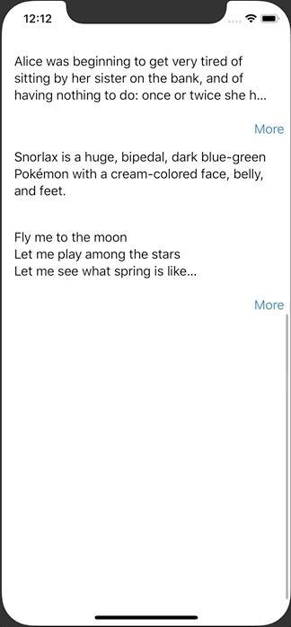

+++
title =  "SwiftUIで続きを読む。。。ボタンがあるViewを実装する"
url = "2020-06-20"
date = "2020-06-20"
description = "SwiftUIで続きを読む。。。ボタンがあるViewを実装する"
tags = [
    "SwiftUI",
    "iOS"
]
categories = [
    "SwiftUI",
    "iOS"
]
archives = "2020/06"
aliases = ["migrate-from-jekyl"]
+++

 

SwiftUIで続きを読む。。。ボタンがあるViewを実装する方法です。
背景を透明色にし、そのサイズを PreferenceKey で取得することで実現しています。

<!-- Google Ads -->


<!-- Amazon Ads -->



