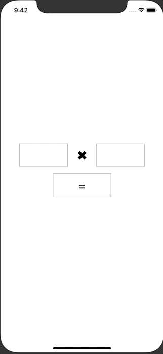

+++
title =  "SwiftUIでUITestを動かす"
url = "2020-06-24"
date = "2020-06-24"
description = "SwiftUIでUITestを動かす"
tags = [
    "SwiftUI",
    "iOS"
]
categories = [
    "SwiftUI",
    "iOS"
]
archives = "2020/06"
aliases = ["migrate-from-jekyl"]
+++

 

SwiftUIでUITestを動かす方法です。
UIKit の時と違って sleep を入れないと良い感じに動かなかったです。
State が変わると際レンダリングが走るせいでしょうか？

<!-- Google Ads -->


<!-- Amazon Ads -->



