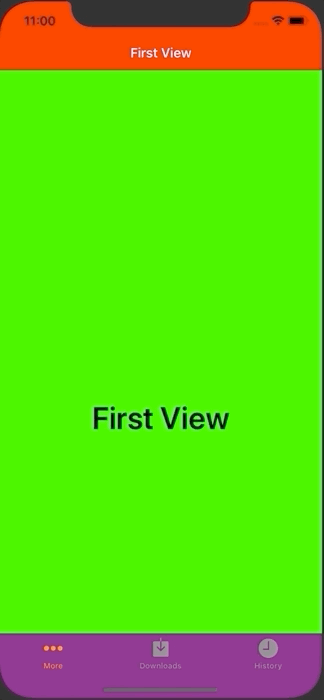

+++
title =  "UITabBarControllerにUINavigationControllerを入れ子で実装する"
url = "2020-06-25"
date = "2020-06-25"
description = "UITabBarControllerにUINavigationControllerを入れ子で実装する"
tags = [
    "Swift",
    "iOS"
]
categories = [
    "Swift",
    "iOS"
]
archives = "2020/06"
aliases = ["migrate-from-jekyl"]
+++

 

UITabBarControllerにUINavigationControllerを入れ子で実装する方法です。
ついでに色もカラフルにしてみました。

<!-- Google Ads -->


<!-- Amazon Ads -->



