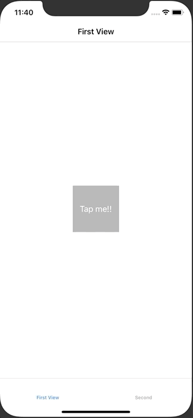

+++
title =  "UserDefaults に配列を保存してTableViewに表示する"
url = "2020-06-27"
date = "2020-06-27"
description = "UserDefaults に配列を保存してTableViewに表示する"
tags = [
    "Swift",
    "iOS"
]
categories = [
    "Swift",
    "iOS"
]
archives = "2020/06"
aliases = ["migrate-from-jekyl"]
+++

 

UserDefaults に配列を保存してTableViewに表示する方法です。
FirstViewController のボタンを押すと UserDefaults に現在の時刻が文字列として保存されます。
SecondViewController を表示すると UserDefaults のデータが読み込まれ、テーブルに表示されます。

<!-- Google Ads -->


<!-- Amazon Ads -->



