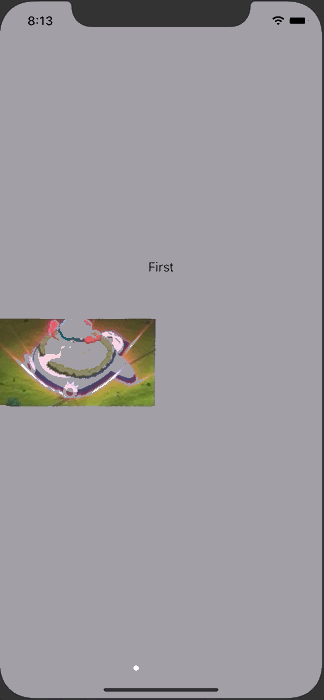

+++
title =  "よくあるチュートリアル画面をUIPageViewControllerとSwiftUIで作る"
url = "2020-06-28"
date = "2020-06-28"
description = "よくあるチュートリアル画面をUIPageViewControllerとSwiftUIで作る"
tags = [
    "SwiftUI",
    "iOS"
]
categories = [
    "SwiftUI",
    "iOS"
]
archives = "2020/06"
aliases = ["migrate-from-jekyl"]
+++

 

UIPageViewControllerとSwiftUIでよくあるチュートリアル画面を作ります。
画面をスワイプすると次の画面が表示されます。

<!-- Google Ads -->


<!-- Amazon Ads -->



