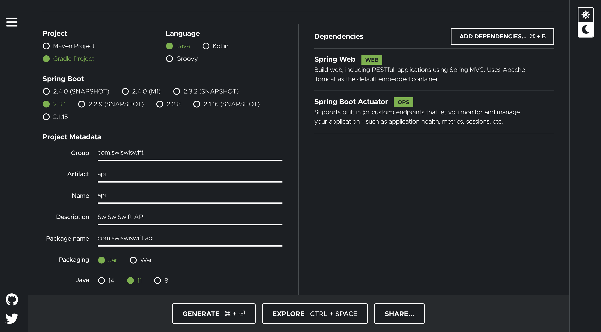

+++
title =  "Spring InitializrでアプリをSpringアプリを作成する"
url = "2020-07-03"
date = "2020-07-03"
description = "Spring InitializrでアプリをSpringアプリを作成する"
tags = [
    "Java",
    "Spring"
]
categories = [
    "Java",
    "Spring"
]
archives = "2020/07"
aliases = ["migrate-from-jekyl"]
+++

 

Spring Initializr でアプリをSpringアプリを作成する方法です。
Spring Initializr を使うとアプリの雛形を作ることができます。

[Spring Initializr](https://start.spring.io/)

<!-- Google Ads -->


<!-- Amazon Ads -->


Project は Gradle、Language は Java にしました。
今回のプロジェクトは API サーバーなので、Spring Web と Spring Boot Actuator を追加しました。
html をサーバーサイドでレンダリングする場合は Thymeleaf も追加する必要があります。

Reference: [Spring Initializrでアプリケーションのひな型を作成する](https://qiita.com/rubytomato@github/items/b2c0686517e1c86ceb48)
