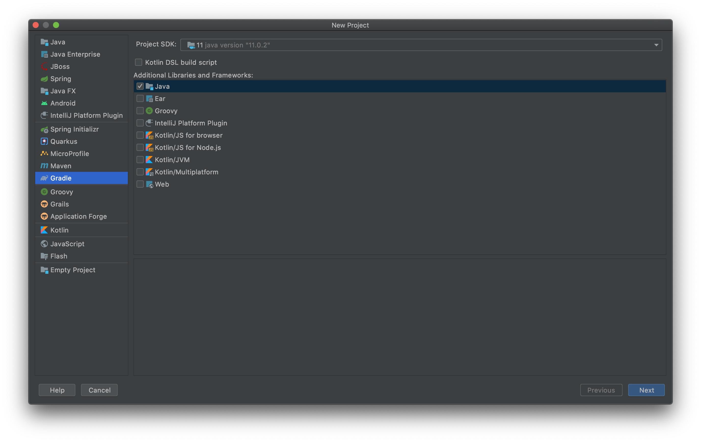
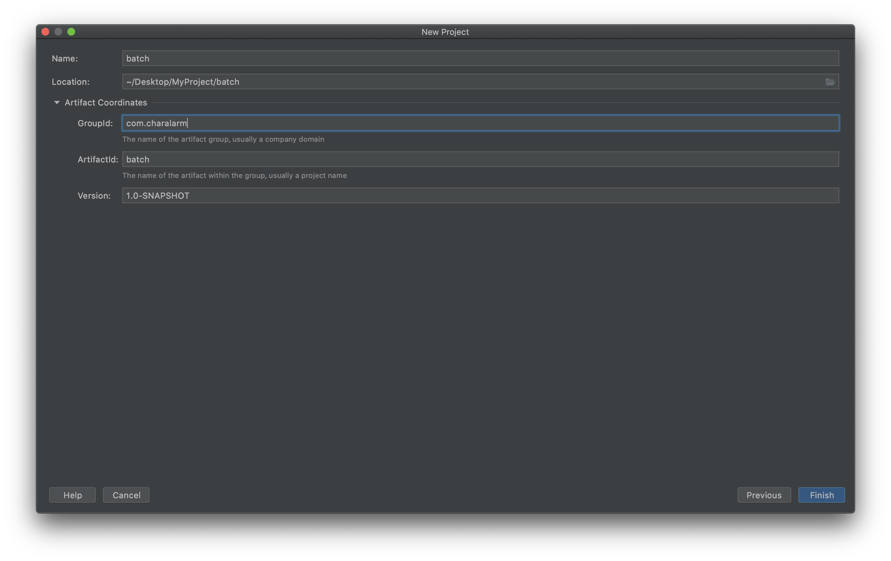

+++
title =  "IntelliJでJavaのGradleのプロジェクトを作成する"
url = "2020-07-04"
date = "2020-07-04"
description = "IntelliJでJavaのGradleのプロジェクトを作成する"
tags = [
    "IntelliJ",
    "Java",
    "Spring"
]
categories = [
    "IntelliJ",
    "Java",
    "Spring"
]
archives = "2020/07"
aliases = ["migrate-from-jekyl"]
+++

<br>

IntelliJでJavaのGradleのプロジェクトを作成する方法です。
IntelliJを使うと簡単にプロジェクトを作ることができます。





<!-- Google Ads -->


<!-- Amazon Ads -->



build.gradle にメインクラスを指定する。

```
jar {
    manifest {
        attributes 'Main-Class': 'com.charalarm.batch.Main'
    }
}
```

```
$ ./gradlew build    # ビルド
$ ./gradlew test -i  # テスト
$ java -jar ./build/libs/batch-1.0-SNAPSHOT.jar com.charalarm.batch  # 実行
```
