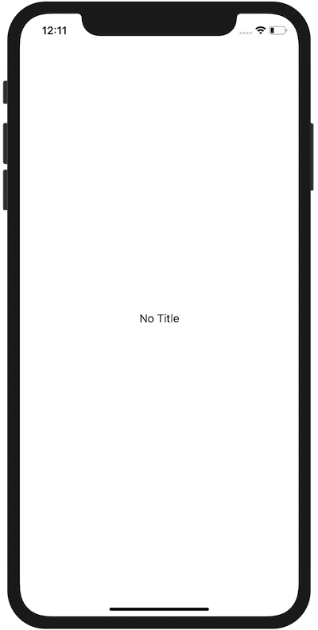

+++
title =  "SwiftUIでNavigationBarを隠す"
url = "2020-08-02"
date = "2020-08-02"
description = "SwiftUIでNavigationBarを隠す"
tags = [
  "Swift",
  "SwiftUI",
  "iOS"
]
categories = [
  "Swift",
  "SwiftUI",
  "iOS"
]
archives = "2020/08"
aliases = ["migrate-from-jekyl"]
+++

 

SwiftUI で NavigationBar を隠す方法です。
<code>.navigationBarHidden(true)</code> を設定すると隠すことができます。
理由は不明ですが、空文字で仮のタイトルを設定する必要がありました。

<!-- Google Ads -->


<!-- Amazon Ads -->



