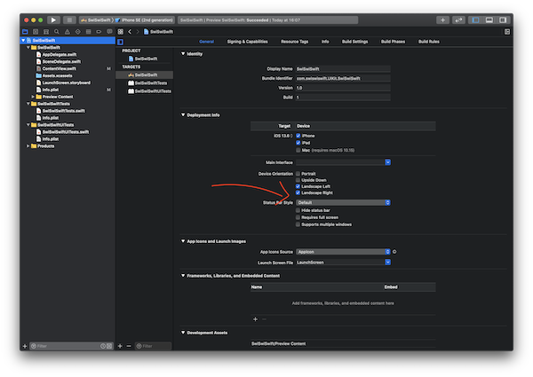
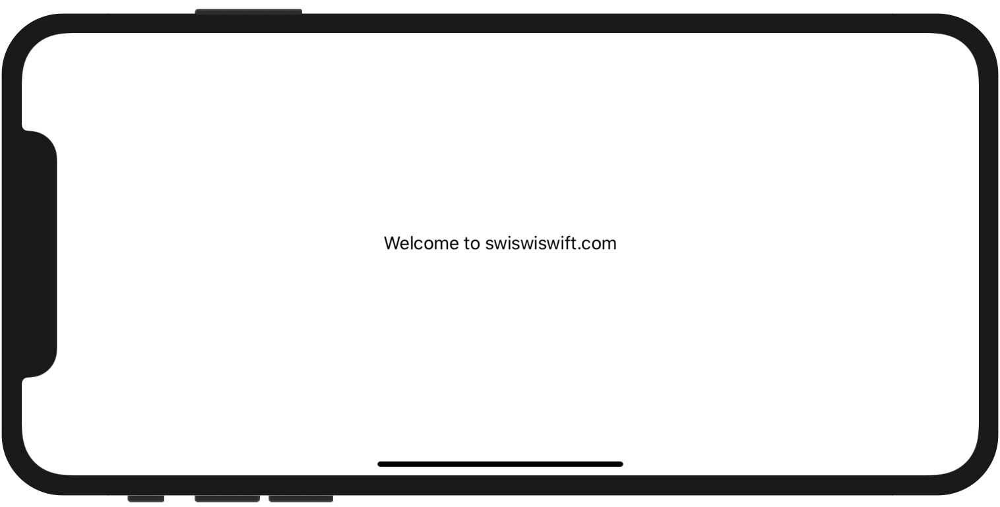
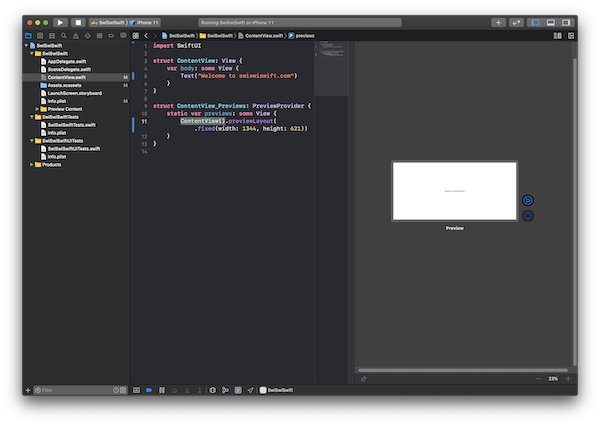

+++
title =  "SwiftUIのPreviewを横向きにする"
url = "2020-08-04"
date = "2020-08-04"
description = "SwiftUIのPreviewを横向きにする"
tags = [
  "Swift",
  "SwiftUI",
  "iOS"
]
categories = [
  "Swift",
  "SwiftUI",
  "iOS"
]
archives = "2020/08"
aliases = ["migrate-from-jekyl"]
+++

 

SwiftUIのPreviewを横向きにする方法です。
Previewのサイズを変更することで実現しました。

Landscape Right, Landscape Left にチェックを入れアプリを横向きにします。

Previewのサイズを端末のサイズに変更します。

<!-- Google Ads -->


<!-- Amazon Ads -->



