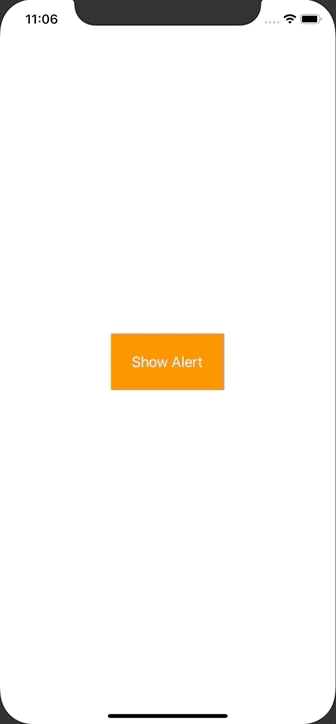

+++
title =  "UIAlertControllerでアラートを表示する"
url = "2020-08-05"
date = "2020-08-05"
description = "UIAlertControllerでアラートを表示する"
tags = [
  "Swift",
  "iOS"
]
categories = [
  "Swift",
  "iOS"
]
archives = "2020/08"
aliases = ["migrate-from-jekyl"]
+++

 

UIAlertControllerを使ってアラートを出すサンプルです。
<code>UIAlertControllerStyle.alert</code> を <code>UIAlertControllerStyle.actionSheet</code> にするとニュッと下から出るタイプのアラートになります。

<!-- Google Ads -->


<!-- Amazon Ads -->



