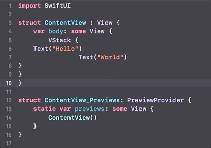

+++
title =  "Xcodeでコードをフォーマットする"
url = "2020-08-07"
date = "2020-08-07"
description = "Xcodeでコードをフォーマットする"
tags = [
  "SwiftUI",
  "iOS"
]
categories = [
  "SwiftUI",
  "iOS"
]
archives = "2020/08"
aliases = ["migrate-from-jekyl"]
+++

 

Xcodeでコードをフォーマットする方法です。
command + a でコードを全て選択し、control + i でコードをフォーマットすることができます。

<!-- Google Ads -->


<!-- Amazon Ads -->

