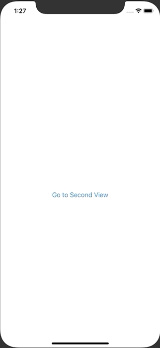

+++
title =  "SwiftUIでプログラムで前の画面に戻る"
url = "2020-09-01"
date = "2020-09-01"
description = "SwiftUIでプログラムで前の画面に戻る"
tags = [
  "Swift",
  "iOS"
]
categories = [
  "Swift",
  "iOS"
]
archives = "2020/09"
aliases = ["migrate-from-jekyl"]
+++

 

SwiftUI でプログラムで前の画面に戻る方法です。
NavigationView と NavigationLink を使うと画面遷移することができます。
戻るボタンは自動で付与されますが、戻るボタン意外の方法で前の画面に戻りたいときは、PresentationMode を使うことで実現できます。

<!-- Google Ads -->


<!-- Amazon Ads -->



