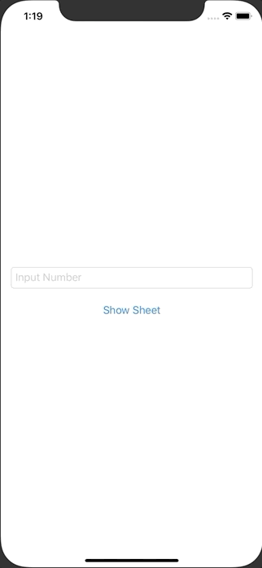

+++
title =  "SwiftUIでアラートとシートを出し分ける"
url = "2020-09-03"
date = "2020-09-03"
description = "SwiftUIでアラートとシートを出し分ける"
tags = [
  "SwiftUI",
  "iOS"
]
categories = [
  "SwiftUI",
  "iOS"
]
archives = "2020/09"
aliases = ["migrate-from-jekyl"]
+++

 

SwiftUIでアラートとシートを出し分ける方法です。
TextField に入力された文字列が Double に変換できるかチェックします。
もし Double に変換できるのであればシートを表示し、もし Double に変換できないのであればアラートを表示します。

<!-- Google Ads -->


<!-- Amazon Ads -->



