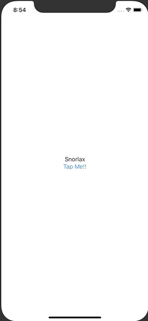

+++
title =  "Buttonを押すとTextの文字が変わる"
url = "2020-09-04"
date = "2020-09-04"
description = "Buttonを押すとTextの文字が変わる"
tags = [
  "SwiftUI",
  "iOS"
]
categories = [
  "SwiftUI",
  "iOS"
]
archives = "2020/09"
aliases = ["migrate-from-jekyl"]
+++

 

SwiftUIでButtonが押されたら文字の色を変える方法です。
ボタンが押されたタイミングで <code>@State var text</code> を更新します。

<!-- Google Ads -->


<!-- Amazon Ads -->



