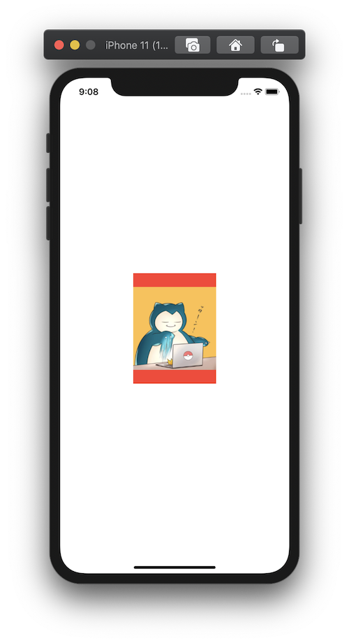

+++
title =  "SwiftUIで画像をリサイズして表示（fit）"
url = "2020-09-05"
date = "2020-09-05"
description = "SwiftUIで画像をリサイズして表示（fit）"
tags = [
  "SwiftUI",
  "iOS"
]
categories = [
  "SwiftUI",
  "iOS"
]
archives = "2020/09"
aliases = ["migrate-from-jekyl"]
+++

 

SwiftUIで画像をリサイズして表示します。
アスペクト比が異なる場合は余白が赤色で表示されます。

<!-- Google Ads -->


<!-- Amazon Ads -->



