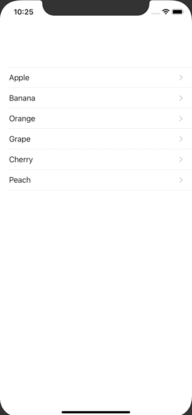

+++
title =  "SwiftUIで画面遷移時に値を渡す"
url = "2020-09-13"
date = "2020-09-13"
description = "SwiftUIで画面遷移時に値を渡す"
tags = [
  "SwiftUI",
  "iOS"
]
categories = [
  "SwiftUI",
  "iOS"
]
archives = "2020/09"
aliases = ["migrate-from-jekyl"]
+++

 

SwiftUIで画面遷移時に値を渡す方法です。
`ContentView` ではフルーツの一覧を表示しています。
フルーツが表示されたセルを押すと `SecondView` に遷移し、選択されたセルのフルーツ名が表示されます。

<!-- Google Ads -->


<!-- Amazon Ads -->



