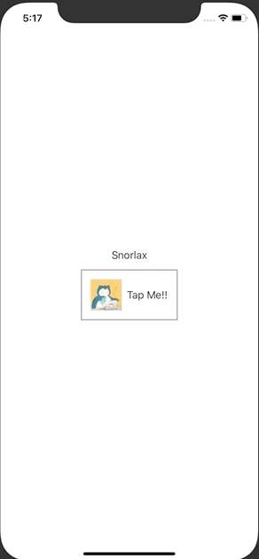

+++
title =  "SwiftUIでButton内の画像やテキストの色を変えない"
url = "2020-09-14"
date = "2020-09-14"
description = "SwiftUIでButton内の画像やテキストの色を変えない"
tags = [
  "SwiftUI",
  "iOS"
]
categories = [
  "SwiftUI",
  "iOS"
]
archives = "2020/09"
aliases = ["migrate-from-jekyl"]
+++

 

SwiftUIでButton内の画像やテキストの色を変えない方法です。
`.buttonStyle(PlainButtonStyle())` ではフルーツの一覧を表示しています。
フルーツが表示されたセルを押すと `SecondView` を設定することで実現できました。

<!-- Google Ads -->


<!-- Amazon Ads -->



