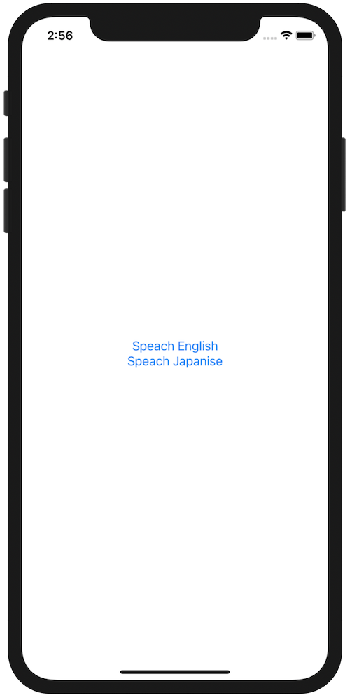

+++
title =  "Swiftで文章を読み上げる（音声合成）"
url = "2020-09-15"
date = "2020-09-15"
description = "Swiftで文章を読み上げる（音声合成）"
tags = [
  "Swift",
  "iOS"
]
categories = [
  "Swift",
  "iOS"
]
archives = "2020/09"
aliases = ["migrate-from-jekyl"]
+++

 

Swiftで文章を読み上げる（音声合成）方法です。
`AVFoundation` を import し、以下のコードを書くことで iPhone に文字列を読み上げてもらうことができます。

<!-- Google Ads -->


<!-- Amazon Ads -->



