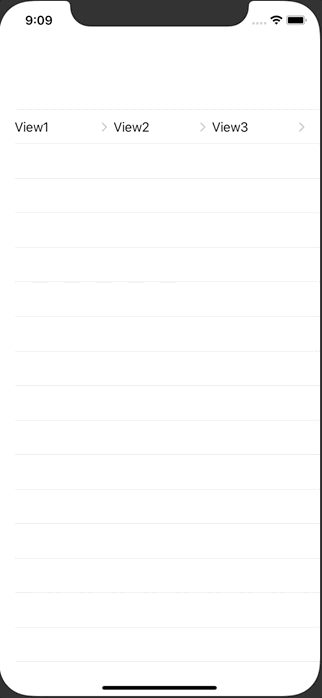
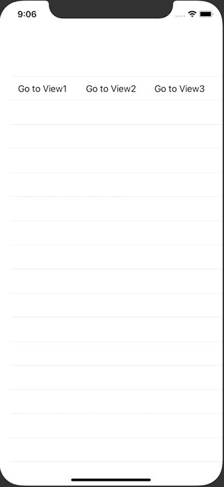

+++
title =  "SwiftUIでListの中に複数のNavigationLinkを設置する"
url = "2020-10-07"
date = "2020-10-07"
description = "SwiftUIでListの中に複数のNavigationLinkを設置する"
tags = [
  "SwiftUI",
  "Swift",
  "iOS"
]
categories = [
  "SwiftUI",
  "Swift",
  "iOS"
]
archives = "2020/10"
aliases = ["migrate-from-jekyl"]
+++

 

SwiftUIでListの中に複数のNavigationLinkを設置する方法です。
素直に実装すると画面遷移が暴発してしまいます。

それを修正するために List のタップジェスチャーを無効化したりする必要がありました。

<!-- Google Ads -->


<!-- Amazon Ads -->



