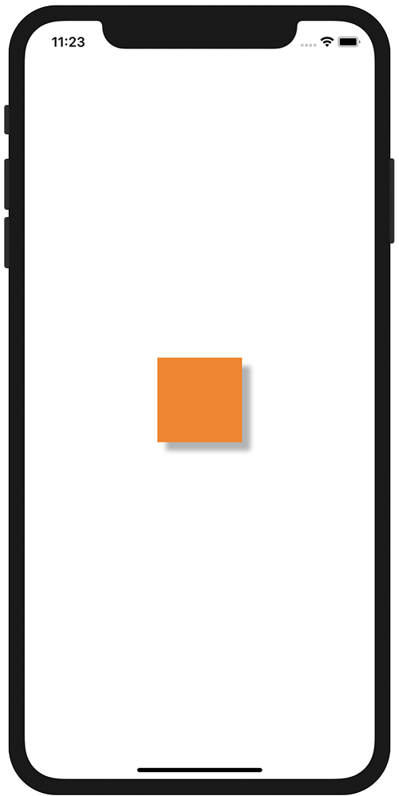

+++
title =  "UIViewに影をつける"
url = "2020-11-04"
date = "2020-11-04"
description = "UIViewに影をつける"
tags = [
  "Swift",
  "iOS"
]
categories = [
  "Swift",
  "iOS"
]
archives = "2020/11"
aliases = ["migrate-from-jekyl"]
+++

 

UIViewに影をつける方法です。
オレンジ色のUIView の周りに影をつけています。
影があると浮き上がって見えるの不思議ですね。

<!-- Google Ads -->


<!-- Amazon Ads -->



