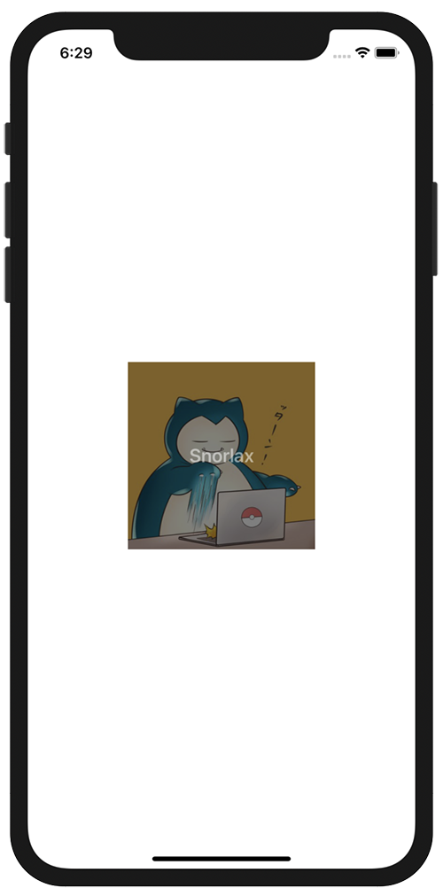

+++
title =  "SwiftUIでViewの上にViewを重ねる"
url = "2020-11-06"
date = "2020-11-06"
description = "SwiftUIでViewの上にViewを重ねる"
tags = [
  "Swift", "SwiftUI"
]
categories = [
  "Swift", "SwiftUI"
]
archives = "2020/11"
aliases = ["migrate-from-jekyl"]
+++

 

SwiftUIでViewの上にViewを重ねる方法です。
Imageの上に半透明に黒いTextを重ねています。

<!-- Google Ads -->


<!-- Amazon Ads -->



