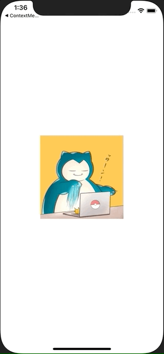

+++
title =  "ImageViewを長押しするとContextMenuを表示する"
url = "2020-12-06"
date = "2020-12-06"
description = "ImageViewを長押しするとContextMenuを表示する"
tags = [
  "Swift",
  "UIKit"
]
categories = [
  "Swift",
  "UIKit"
]
archives = "2020/12"
aliases = ["migrate-from-jekyl"]
+++

 

ImageViewを長押しするとUIMenuを表示する方法です。
アイコンが表示されているImageViewを長押しするとContextMenuが表示されます。
少しのコードを書くだけでリッチなUIが実現できて便利です。

<!-- Google Ads -->


<!-- Amazon Ads -->



