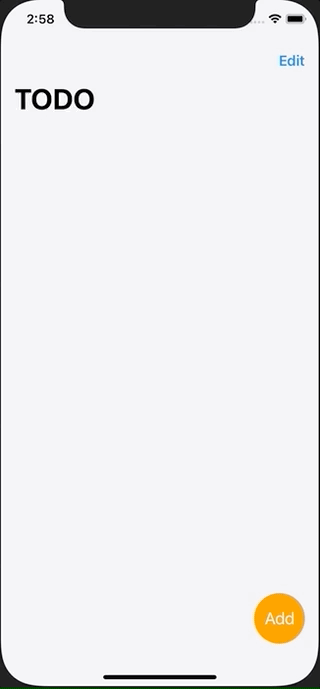
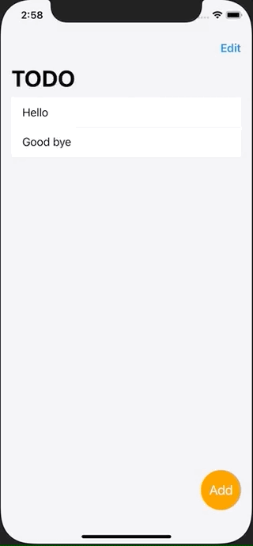

+++
title =  "SwiftUIを使ったTODOアプリのサンプル"
url = "2020-12-10"
date = "2020-12-10"
description = "SwiftUIを使ったTODOアプリのサンプル"
tags = [
  "Swift",
  "SwiftUI"
]
categories = [
  "Swift",
  "SwiftUI"
]
archives = "2020/12"
aliases = ["migrate-from-jekyl"]
+++

 

SwiftUIを使ったTODOアプリのサンプルコードです。
InputView で入力した TODOは ContentView に表示されます。

<!-- Google Ads -->


<!-- Amazon Ads -->



