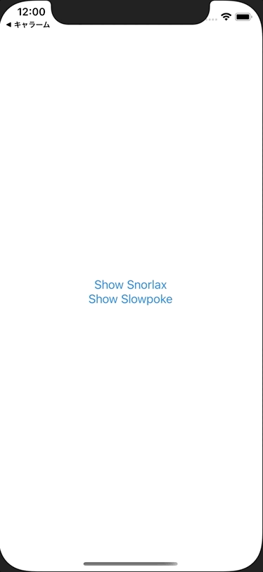

+++
title =  "SwiftUIで複数のモーダルをEnumで出し分ける"
url = "2021-02-03"
date = "2021-02-03"
description = "SwiftUIで複数のモーダルをEnumで出し分ける"
tags = [
  "iOS",
  "SwiftUI"
]
categories = [
  "iOS",
  "SwiftUI"
]
archives = "2020/02"
aliases = ["migrate-from-jekyl"]
+++

 

SwiftUIで複数のモーダルをEnumで出し分ける方法です。
enumを使うことでスッキリと書くことができました。
iOS13では使えないので気をつけてください。

<!-- Google Ads -->


<!-- Amazon Ads -->



