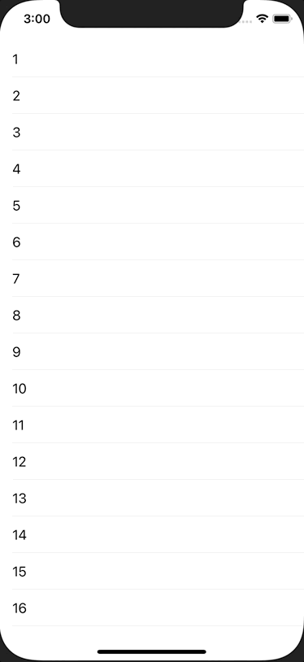

+++
title =  "TableViewのセルを長押しでContextMenuを表示する"
url = "2021-02-04"
date = "2021-02-04"
description = "TableViewのセルを長押しでContextMenuを表示する"
tags = [
  "iOS",
  "Swift"
]
categories = [
  "iOS",
  "Swift"
]
archives = "2020/02"
aliases = ["migrate-from-jekyl"]
+++

 

TableViewのセルを長押しでContextMenuを表示する方法です。
手軽にメニューが表示することができ、とても使い勝手が良いので積極的に使っていきたいです。

<!-- Google Ads -->


<!-- Amazon Ads -->



