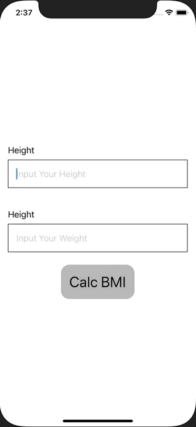

+++
title =  "SwiftUIでBMIを計算し、結果を別のViewで表示する"
url = "2021-02-06"
date = "2021-02-06"
description = "SwiftUIでBMIを計算し、結果を別のViewで表示する"
tags = [
  "iOS",
  "SwiftUI"
]
categories = [
  "iOS",
  "SwiftUI"
]
archives = "2020/02"
aliases = ["migrate-from-jekyl"]
+++

 

SwiftUIでBMIを計算し、結果を別のViewで表示する方法です。
身長と体重を入力し、計算ボタンを押すことで計算したBMIを表示しています。

<!-- Google Ads -->


<!-- Amazon Ads -->




ただ上の例では bmi と showingSheet の二つのプロパティが必要です。
新しく ContentActionSheetを定義する必要がありますが、以下の方法だとプロパティの数を減らしたりenumの種類によってシートの出し分けをすることができます。

<!-- Amazon Ads -->




