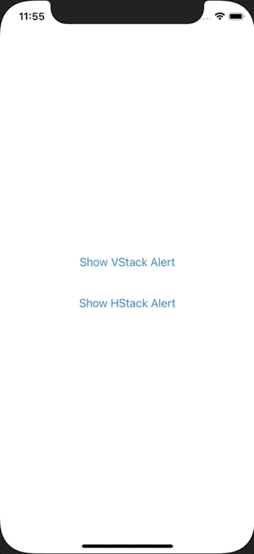

+++
title =  "SwiftUIでアラートを入れ子にして使うことができない"
url = "2021-02-09"
date = "2021-02-09"
description = "SwiftUIでアラートを入れ子にして使うことができない"
tags = [
  "iOS",
  "SwiftUI"
]
categories = [
  "iOS",
  "SwiftUI"
]
archives = "2020/02"
aliases = ["migrate-from-jekyl"]
+++

 

SwiftUIでアラートを入れ子にして使うことができなかったのでそのメモです。
以下のコードの様に HStack の中に VStack を入れ、それぞれに .alert を使うと内側の .alert がうまく動かなかったです。
.alert は入れ子にしない方が良さそうです。

<!-- Google Ads -->


<!-- Amazon Ads -->




