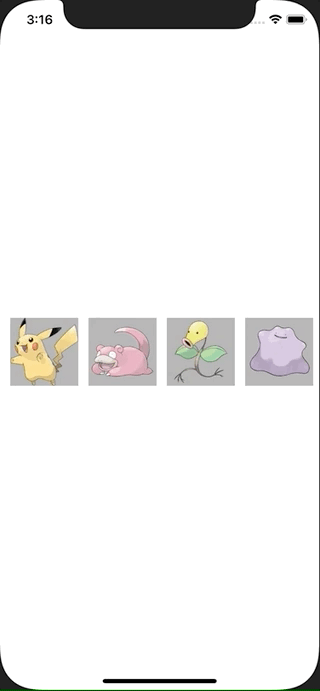

+++
title =  "SwiftUIでViewを横スクロールで表示する"
url = "2021-03-02"
date = "2021-03-02"
description = "SwiftUIでViewを横スクロールで表示する"
tags = [
  "iOS",
  "SwiftUI"
]
categories = [
  "iOS",
  "SwiftUI"
]
archives = "2020/03"
aliases = ["migrate-from-jekyl"]
+++

 

SwiftUIでViewを横スクロールで表示する方法です。
SwiftUIだと簡単に実装できて良いですね！！

<!-- Google Ads -->


<!-- Amazon Ads -->




