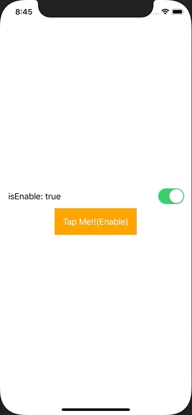

+++
title =  "SwiftUIでButtonを有効にしたり無効にしたりする"
url = "2021-03-04"
date = "2021-03-04"
description = "SwiftUIでButtonを有効にしたり無効にしたりする"
tags = [
  "iOS",
  "SwiftUI"
]
categories = [
  "iOS",
  "SwiftUI"
]
archives = "2020/03"
aliases = ["migrate-from-jekyl"]
+++

 

SwiftUIでButtonを有効にしたり無効にしたりする方法です。
Toggleを押すとボタンが有効になったり、無効になったりします。

<!-- Google Ads -->


<!-- Amazon Ads -->




