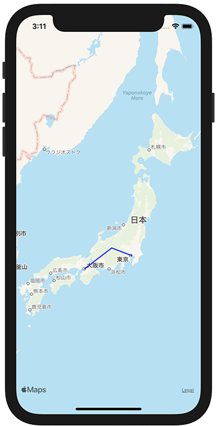

+++
title =  "SwiftでMKMapViewに線を引く"
url = "2021-03-05"
date = "2021-03-05"
description = "SwiftでMKMapViewに線を引く"
tags = [
  "iOS",
  "SwiftUI"
]
categories = [
  "iOS",
  "SwiftUI"
]
archives = "2020/03"
aliases = ["migrate-from-jekyl"]
+++

 

SwiftでMKMapViewに線を引く方法です。
以下の例では大阪、松本、東京で線を引いています。

<!-- Google Ads -->


<!-- Amazon Ads -->




