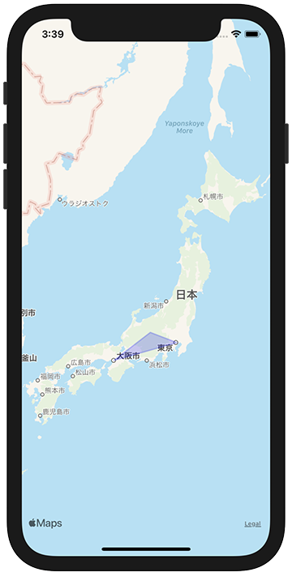

+++
title =  "SwiftでMKMapViewに図を追加する"
url = "2021-03-06"
date = "2021-03-06"
description = "SwiftでMKMapViewに図を追加する"
tags = [
  "iOS",
  "Swift"
]
categories = [
  "iOS",
  "Swift"
]
archives = "2020/03"
aliases = ["migrate-from-jekyl"]
+++

 

SwiftでMKMapViewに図を追加する方法です。
以下の例では大阪、松本、東京を結ぶ三角形を追加しています。

<!-- Google Ads -->


<!-- Amazon Ads -->




