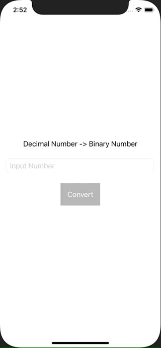

+++
title =  "Swiftで10進数を2進数に変換する"
url = "2021-03-08"
date = "2021-03-08"
description = "Swiftで10進数を2進数に変換する"
tags = [
  "iOS",
  "SwiftUI"
]
categories = [
  "iOS",
  "SwiftUI"
]
archives = "2020/03"
aliases = ["migrate-from-jekyl"]
+++

 

Swiftで10進数を2進数に変換する方法です。
TextFieldに数字を入力し、変換ボタンを押すと2進数に変換されます。

<!-- Google Ads -->


<!-- Amazon Ads -->




