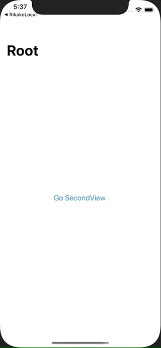

+++
title =  "SwiftUIで初めの画面に遷移する（popToRootViewController）"
url = "2021-03-09"
date = "2021-03-09"
description = "SwiftUIで初めの画面に遷移する（popToRootViewController）"
tags = [
  "iOS",
  "SwiftUI"
]
categories = [
  "iOS",
  "SwiftUI"
]
archives = "2020/03"
aliases = ["migrate-from-jekyl"]
+++

 

SwiftUIで初めの画面に遷移する（popToRootViewController）方法です。
`isDetailLink` がポイントです。

<!-- Google Ads -->


<!-- Amazon Ads -->




