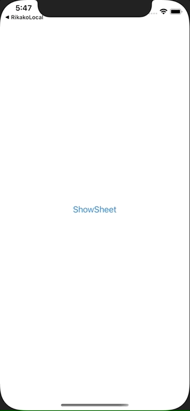

+++
title =  "SwiftUIでシートを表示し、プッシュ遷移後にシートを閉じる"
url = "2021-03-10"
date = "2021-03-10"
description = "SwiftUIでシートを表示し、プッシュ遷移後にシートを閉じる"
tags = [
  "iOS",
  "SwiftUI"
]
categories = [
  "iOS",
  "SwiftUI"
]
archives = "2020/03"
aliases = ["migrate-from-jekyl"]
+++

 

SwiftUIでシートを表示し、プッシュ遷移後にシートを閉じる方法です。
遷移後のシートでもisPresentedの情報を保持するのがポイントです。

<!-- Google Ads -->


<!-- Amazon Ads -->




