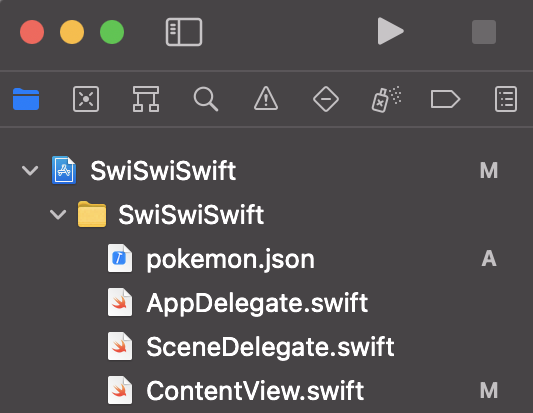
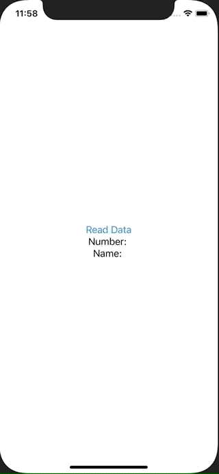

+++
title =  "Swiftでプロジェクトの中に含まれるJSONファイルを読み込む"
url = "2021-04-01"
date = "2021-04-01"
description = "Swiftでプロジェクトの中に含まれるJSONファイルを読み込む"
tags = [
  "iOS",
  "Swift"
]
categories = [
  "iOS",
  "Swift"
]
archives = "2021/04"
aliases = ["migrate-from-jekyl"]
+++

<br>

Swiftでプロジェクトの中に含まれるJSONファイルを読み込む方法です。
まずプロジェクトに読み込みたい JSON ファイルを追加します。
画像のように追加します。



追加した JSON ファイルの中身は以下です。

```
{
    "number": 143,
    "name": "Snorlax"
}
```

次に追加した JSON ファイルをデコードするためのstructをJSON の中身に合わせて作成します。
ボタンを押すとプロジェクト中の pokemon.json を読み込み、Pokemon構造体にデコードし、State を更新させて文字列を表示しています。



<!-- Google Ads -->


<!-- Amazon Ads -->




