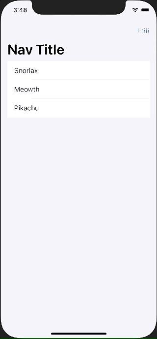

+++
title =  "SwiftUIでListをEditModeにして並び替える"
url = "2021-04-02"
date = "2021-04-02"
description = "SwiftUIでListをEditModeにして並び替える"
tags = [
  "iOS",
  "SwiftUI"
]
categories = [
  "iOS",
  "SwiftUI"
]
archives = "2021/04"
aliases = ["migrate-from-jekyl"]
+++

 

SwiftUIでListをEditModeにして並び替える方法です。
UITableViewのEditModeのようにして並び替えることができます。
Listの中にforを定義する必要があります。最初ハマりました。

<!-- Google Ads -->


<!-- Amazon Ads -->




