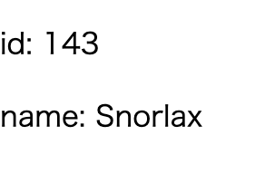

+++
title =  "Elmで型エイリアスを定義する"
url = "2021-04-04"
date = "2021-04-04"
description = "Elmで型エイリアスを定義する"
tags = [
  "Elm"
]
categories = [
  "Elm"
]
archives = "2021/04"
aliases = ["migrate-from-jekyl"]
+++

 

Elmで型エイリアスを定義する方法です。
Pokemonという型エイリアスを定義して、その内容を表示しています。

<!-- Google Ads -->


<!-- Amazon Ads -->




