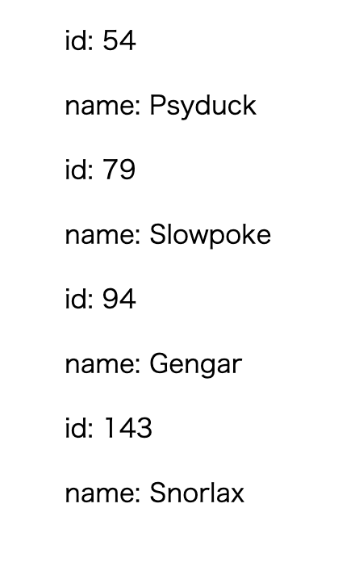

+++
title =  "Elmで型エイリアスが入った配列を繰り返し表示す"
url = "2021-04-05"
date = "2021-04-05"
description = "Elmで型エイリアスが入った配列を繰り返し表示する"
tags = [
  "Elm"
]
categories = [
  "Elm"
]
archives = "2021/04"
aliases = ["migrate-from-jekyl"]
+++

 

Elmで型エイリアスが入った配列を繰り返し表示する方法です。
Pokemonという型エイリアスの配列の内容を繰り返して表示しています。

<!-- Google Ads -->


<!-- Amazon Ads -->




