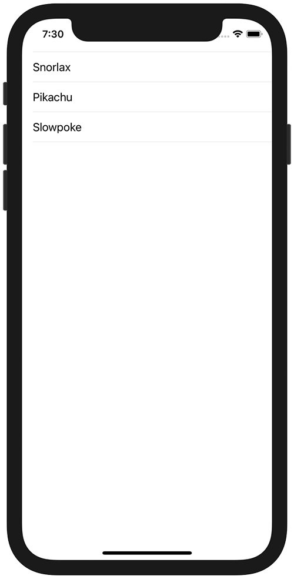

+++
title =  "SwiftUIのListでSpacerの部分にもタップ判定をつける"
url = "2021-04-07"
date = "2021-04-07"
description = "SwiftUIのListでSpacerの部分にもタップ判定をつける"
tags = [
  "SwiftUI"
]
categories = [
  "SwiftUI"
]
archives = "2021/04"
aliases = ["migrate-from-jekyl"]
+++

 

SwiftUIのListでSpacerの部分にもタップ判定をつける方法です。
`.contentShape(Rectangle())` を設定することでタップ範囲を広げています。

参考サイト
[SwiftUI pick a value from a list with ontap gesture](https://stackoverflow.com/questions/58500295/swiftui-pick-a-value-from-a-list-with-ontap-gesture)

<!-- Google Ads -->


<!-- Amazon Ads -->




