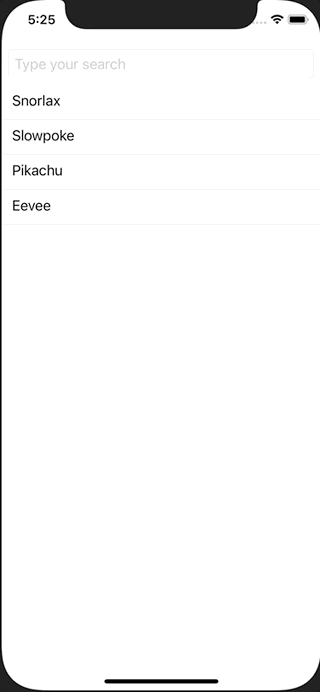

+++
title =  "SwiftUIでSearchBar(TextField)を使って検索する"
url = "2021-05-01"
date = "2021-05-01"
description = "SwiftUIでSearchBar(TextField)を使って検索する"
tags = [
  "SwiftUI"
]
categories = [
  "SwiftUI"
]
archives = "2021/05"
aliases = ["migrate-from-jekyl"]
+++

 

SwiftUIでSearchBar(TextField)を使って検索する方法です。
TextFiled に文字を入力するとポケモンを検索します。

<!-- Google Ads -->


<!-- Amazon Ads -->




