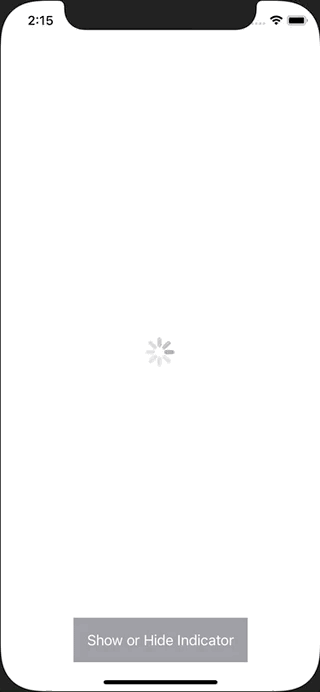

+++
title =  "SwiftUIでActivityIndicatorを表示する"
url = "2021-05-06"
date = "2021-05-06"
description = "SwiftUIでActivityIndicatorを表示する"
tags = [
  "SwiftUI"
]
categories = [
  "SwiftUI"
]
archives = "2021/05"
aliases = ["migrate-from-jekyl"]
+++

 

SwiftUIでActivityIndicatorを表示する方法です。
ロード中などのくるくるするやつを表示したり隠したりしています。

<!-- Google Ads -->


<!-- Amazon Ads -->




