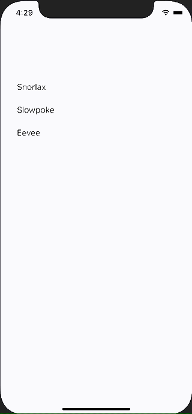

+++
title =  "SwiftUIでListにButtonを設定してパラメーターの違う画面に遷移する"
url = "2021-05-09"
date = "2021-05-09"
description = "SwiftUIでListにButtonを設定してパラメーターの違う画面に遷移する"
tags = [
  "SwiftUI"
]
categories = [
  "SwiftUI"
]
archives = "2021/05"
aliases = ["migrate-from-jekyl"]
+++

 

SwiftUIでListにButtonを設定してパラメーターの違う画面に遷移する方法です。
詳細ページに遷移するような使い方を想定しています。

<!-- Google Ads -->


<!-- Amazon Ads -->




