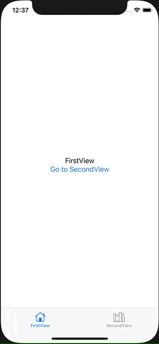

+++
title =  "SwiftUIのTabViewのタブをコードから動的に切り替える"
url = "2021-06-01"
date = "2021-06-01"
description = "SwiftUIのTabViewのタブをコードから動的に切り替える"
tags = [
  "SwiftUI"
]
categories = [
  "SwiftUI"
]
archives = "2021/06"
aliases = ["migrate-from-jekyl"]
+++

 

SwiftUIのTabViewのタブをコードから動的に切り替える方法です。
コードで動的にタブを切り替える方法です

参考: [Programmatically change to another tab in SwiftUI](https://stackoverflow.com/questions/62504400/programmatically-change-to-another-tab-in-swiftui)

<!-- Google Ads -->


<!-- Amazon Ads -->



