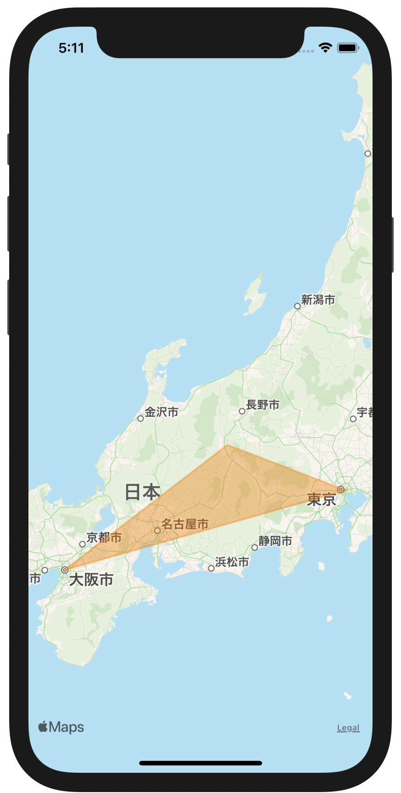

+++
title =  "iOSでMKMapViewの上に図形を描画する"
url = "2021-07-01"
date = "2021-07-01"
description = "iOSでMKMapViewの上に図形を描画する"
tags = [
  "Swift"
]
categories = [
  "Swift"
]
archives = "2021/07"
aliases = ["migrate-from-jekyl"]
+++

 

iOSのMKMapViewの上に図形を描画する方法です。
`MKPolygon` を使うことで任意の多角形を描画することができます。



<!-- Amazon Ads -->


<!-- Google Ads -->


